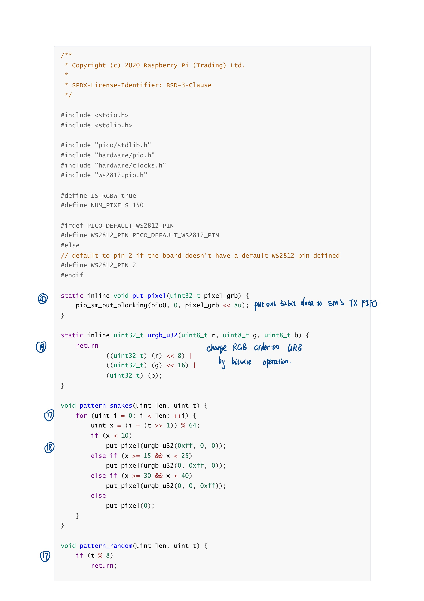
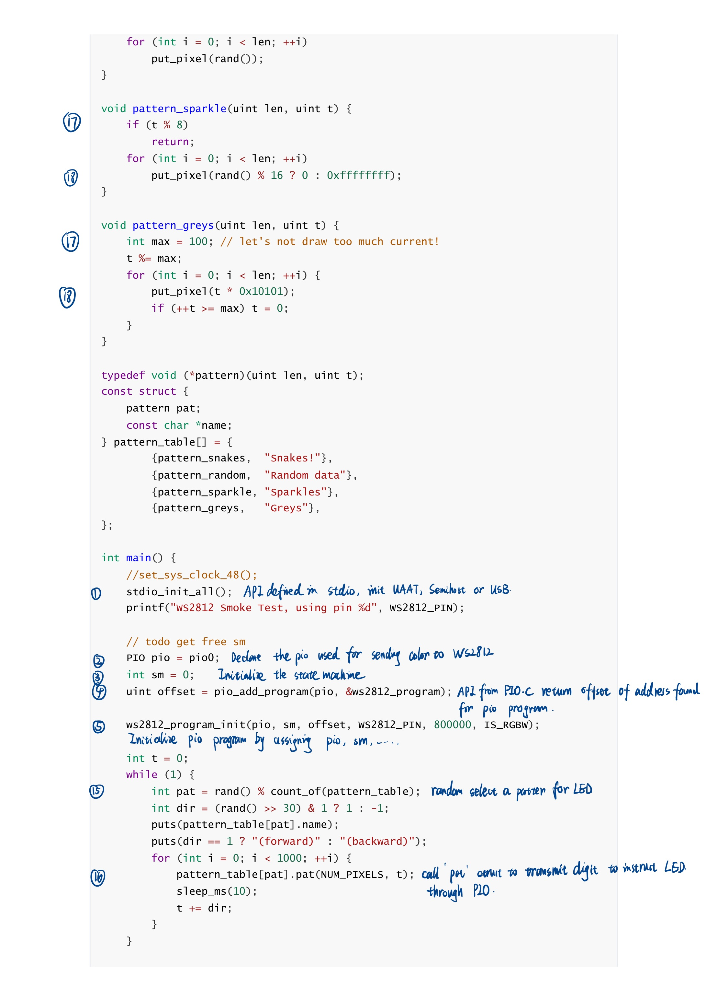
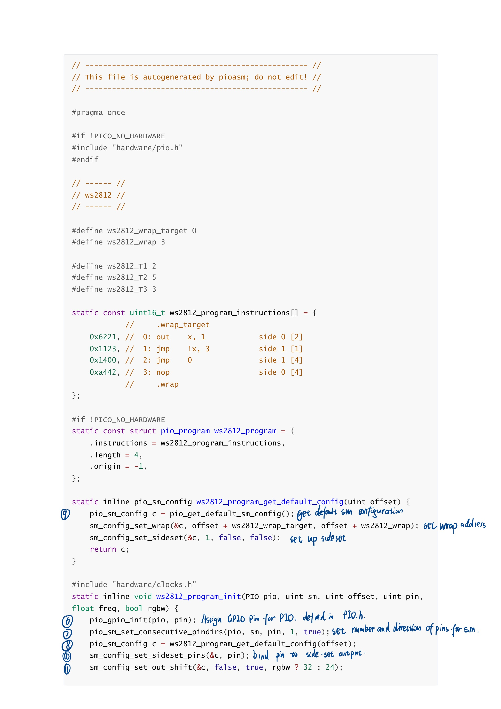
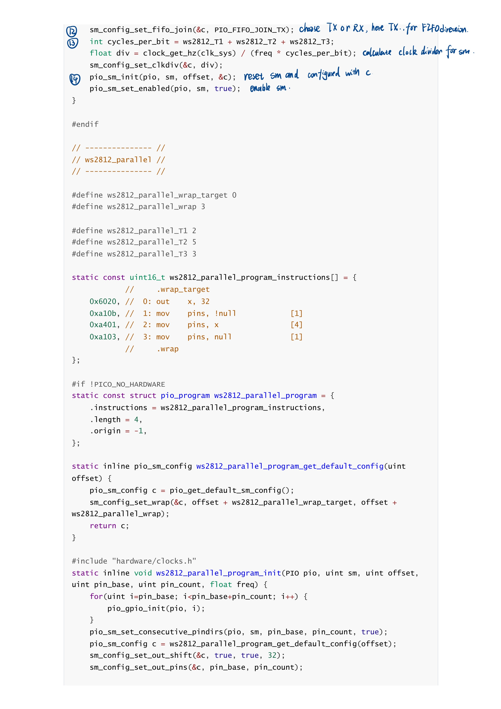
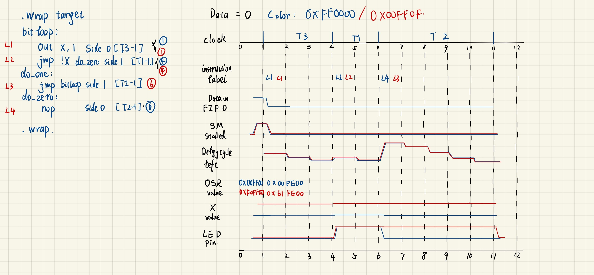
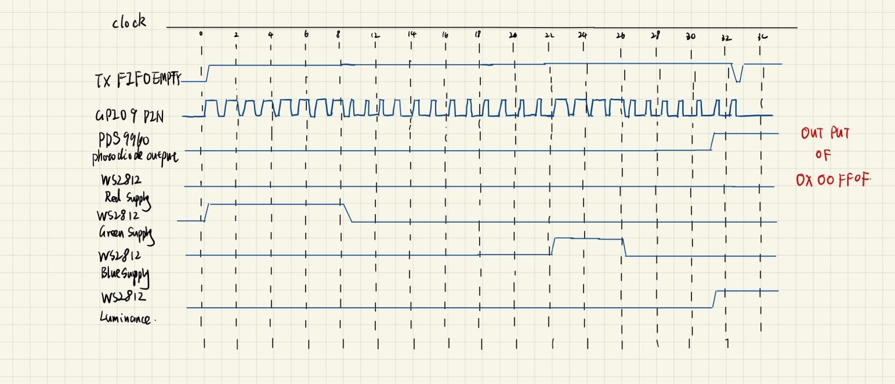

University of Pennsylvania, ESE 5190: Intro to Embedded Systems, Lab 2A

    Haoze Wu
    Tested on: Lenovo Thinkbook 16+ Ubuntu 22.04 LTS

## Overview 

This repo is for Lab 2A in ESE5190@Penn, mainly covering up the PIO and a process to develop a gradually precise model for a simple PIO example: light up a WS2812 LED on Adafruit Qt Py RP2040 board.

## Q&A for PIO

Before going into details about how the PIO is handling codes using all kinds of registers, we first going through a Q&A session which leads us to the essential and advance of the PIO on Raspberry Pi RP2040 chips.

**Q: Why is bit-banging impractical on your laptop, despite it having a  much faster processor than the RP2040?**

A: First, the conflicts between the fast speed of CPU and the rather slow speed of I/O determine the low-efficiency of using a bit-bang methods on laptop. Every time when a peripheral requires the CPU to handle the I/O through bit-bang, it must first using Interrupt to block CPU from what it is current working and switch to the I/O task, which is so inefficient for calling such an interrupt several within an I/O task due to the low speed of the peripheral. Every time, the CPU have to preserve the scene and deposit current work, switch to handle the I/O which needs a long time, and come back to recover what has been deposited, which use up some register and caches that is resource-consuming as well.

Second, CPU on laptop nowadays are working under a much more complex system than microcontrollers, which means the CPU would keep many hundreds of instructions in-flight on a single core at once, which has drawbacks when trying to switch rapidly between hard real time tasks.

**Q: What are some cases where directly using the GPIO might be a  better choice than using the PIO hardware? **

A: Some burst I/O needs may be better to satisfy when handling them using GPIO. Also, some tasks without strict requirement for  cock synchronization would also be simpler to deal with using GPIO. In the case of lighting up a WS2812 LED, send a signal contains a high voltage to power the WS2812, which is not strict restricted to the timing and clocks, is solved by deploying a GPIO interface.

**Q: How do you get data into/out from a PIO state machine? **

A: Getting data into a PIO state machine would us the TX FIFO register for the intended PIO machine while getting data from the PIO state machine is basically an `OUT` instruction to transfer data from Out Shift Register(OSR) to Scratch register X or Y, which is binding with a specific PIN as the output destination.

**Q: How do you program a PIO state machine?**

A: To program a PIO state machine, we would better make full use of the PIO asm-like instructions to make up a `.pio` file containing the the definition of a PIO module. Besides, we should also configure the CMake environment to build and make this PIO file using the SDK provided by Raspberry for RP2040.

## Flow of the PIO

For the task to light up a WS2812 LED, the C code and the auto-generated header from PIO is annotated here.

Follow the number annotated with the code, we could build up a basic view of the data flow of the PIO transmitting data to WS2812 LED. Also, it is possible to track the value within the registers inside the PIO. At the time when color data has been written to TX FIFO before the state machine transfer them to the LED, the value inside some registers are listed as follows:

|               |  ADDRESS   | OFFSET |                             NAME                             |                          VALUE                          | notes                                                        |
| :-----------: | :--------: | :----: | :----------------------------------------------------------: | :-----------------------------------------------------: | ------------------------------------------------------------ |
|     BASE      | 0x50200000 |  N/A   |                             PIO0                             |                           N/A                           | Base  address for the two PIO in RP2040.                     |
|     CLTR      | 0x50200000 | 0x000  |                     PIO control register                     | 0000 0000 0000 0000 0000  0000 0000 0001 | 12:31 digits are reserved, and  state machine 0 is enabled.  |
|     FSTAT     | 0x50200004 | 0x004  |                     FIFO status register                     | 0000 1110 0000 0001 0000  1111 0000 0000 | State machine 0's TX FIFO is  filled with color data while its RX FIFO is not used.     Other 3 state machine is not enabled. |
|    FDEBUG     | 0x50200008 | 0x008  |                     FIFO debug register                      | 0000 0001 0000 0000 0000  0000 0000 0000 | State machine 0's TX FIFO is  full and its RX is not used here.     Other 3 state machine is not enabled. |
|    FLEVEL     | 0x502000c  | 0x00c  |                     FIFO level register                      | 0000 0000 0000 0000 0000  0000 0000 0001 | Only state machine 0's TX is  used, no level specficed for other TX or RX register |
|     TXF0      | 0x5020010  | 0x010  |                        TXF0 register                         | 0000 0000 1111 1111 0000  0000 0000 0000 | The color 0xFF0000 is used here  for state machine 0. Since the WS2812 takes onlt GRB channel orders, the RGB  is transmitted in the form of GRB after transform. |
|     TXF1      | 0x5020014  | 0x014  |                        TXF1 register                         | 0000 0000 0000 0000 0000  0000 0000 0000 | Not used, keep  default.                                     |
|     TXF2      | 0x5020018  | 0x018  |                        TXF2 register                         | 0000 0000 0000 0000 0000  0000 0000 0000 | Not used, keep  default.                                     |
|     TXF3      | 0x502001c  | 0x01c  |                        TXF3 register                         | 0000 0000 0000 0000 0000  0000 0000 0000 | Not used, keep  default.                                     |
|     RXF0      | 0x5020020  | 0x020  |                        RXF0 rigister                         |                          EMPTY                          | Not used, default  empty.                                    |
|     RXF1      | 0x5020024  | 0x024  |                        RXF1 rigister                         |                          EMPTY                          | Not used, default  empty.                                    |
|     RXF2      | 0x5020028  | 0x028  |                        RXF2 rigister                         |                          EMPTY                          | Not used, default  empty.                                    |
|     RXF3      | 0x502002c  | 0x02c  |                        RXF3 rigister                         |                          EMPTY                          | Not used, default  empty.                                    |
|  INSTR_MEM0   | 0x5200048  | 0x048  |              WO ACCESS TO INSTRUCTION MEMORY  0              | 0000 0000 0000 0000 0110  0010 0010 0001 | Store the first instruction  out  x, 1 side 0 [2] here in the 15-0  digits while reserving 31-16 digits. |
|  INSTR_MEM1   | 0x502004c  | 0x04c  |              WO ACCESS TO INSTRUCTION MEMORY  1              | 0000 0000 0000 0000 0001  0001 0010 0011 | Store the first instruction  out  jmp !x, 3 side 1 [1] here in the  15-0 digits while reserving 31-16 digits. |
|  INSTR_MEM2   | 0x5020050  | 0x050  |              WO ACCESS TO INSTRUCTION MEMORY  2              | 0000 0000 0000 0000 0001  0100 0000 0000 | Store the first instruction  out  jmp 0 side 1 [4] here in the  15-0 digits while reserving 31-16 digits. |
|  INSTR_MEM3   | 0x5020054  | 0x054  |              WO ACCESS TO INSTRUCTION MEMORY  3              | 0000 0000 0000 0000 1010  0100 0100 0010 | Store the first instruction  out  nop side 0 [4] here in the 15-0  digits while reserving 31-16 digits. |
|  INSTR_MEM4   | 0x5020058  | 0x058  |              WO ACCESS TO INSTRUCTION MEMORY  4              | 0000 0000 0000 0000 0000  0000 0000 0000 | Apart from those 4 slots used  for the 4 instructions, other instruction memories are not used and allow WO  access. |
|      ...      |    ...     |  ...   |                             ...                              |                           ...                           | ...                                                          |
|  INSTR_MEM31  | 0x50200c4  | 0x0c4  |             WO ACCESS TO INSTRUCTION MEMORY  31              | 0000 0000 0000 0000 0000  0000 0000 0000 | Apart from those 4 slots used  for the 4 instructions, other instruction memories are not used and allow WO  access. |
|  SM0_CLKDIV   | 0x50200c8  | 0x0c8  |               Clock Divisor register for SM 0                | 0000 0000 0000 1111 1010  0000 0000 0000 | Since the default clk_sys is  150MHz, the assigned frequency is 800000 and the cycles per bit is 8, so the  INT is 15 and the FRAC is 0.625 |
|  SM1_CLKDIV   | 0x50200e0  | 0x0e0  |               Clock Divisor register for SM 1                | 0000 0000 0000 0000 0000  0000 0000 0000 | State machine 1 is not used.                                 |
|  SM2_CLKDIV   | 0x50200f8  | 0x0f8  |               Clock Divisor register for SM 2                | 0000 0000 0000 0000 0000  0000 0000 0000 | State machine 2 is not used.                                 |
|  SM3_CLKDIV   | 0x5020110  | 0x110  |               Clock Divisor register for SM 3                | 0000 0000 0000 0000 0000  0000 0000 0000 | State machine 3 is not used.                                 |
| SM0_EXECCTRL  | 0x50200cc  | 0x0cc  |      Execution/behavioral settings  for state machine 0      | 0000 0000 0000 0001 1111  0000 0000 0000 | Wrap top set to 0x1f while some  other address is nke known. |
| SM1_EXECCTRL  | 0x50200e4  | 0x0e4  |      Execution/behavioral settings  for state machine 1      | 0000 0000 0000 0001 1111  0000 1000 0000 | State machine 1 is not used.                                 |
| SM2_EXECCTRL  | 0x50200fc  | 0x0fc  |      Execution/behavioral settings  for state machine 2      | 0000 0000 0000 0001 1111  0000 1000 0000 | State machine 2 is not used.                                 |
| SM3_EXECCTRL  | 0x5020114  | 0x114  |      Execution/behavioral settings  for state machine 3      | 0000 0000 0000 0001 1111  0000 1000 0000 | State machine 3 is not used.                                 |
| SM0_SHIFTCTRL | 0x50200d0  | 0x0d0  | Control behavior of the I/O  shift registers for state machine 0 | 0000 0000 0000 0110 0000  0000 0000 0000 | Shift OSR to left and AUTOPULL  is enabled in the configuration with a default pull threshold of 32. |
| SM1_SHIFTCTRL | 0x50200e8  | 0x0e8  | Control behavior of the I/O  shift registers for state machine 1 | 0000 0000 0000 1100 0000  0000 0000 0000 | State machine 1 is not used.                                 |
| SM2_SHIFTCTRL | 0x5020100  | 0x100  | Control behavior of the I/O  shift registers for state machine 2 | 0000 0000 0000 1100 0000  0000 0000 0000 | State machine 2 is not used.                                 |
| SM3_SHIFTCTRL | 0x5020118  | 0x118  | Control behavior of the I/O  shift registers for state machine 3 | 0000 0000 0000 0110 0000  0000 0000 0000 | State machine 3 is not used.                                 |
|   SM0_ADDR    | 0x50200d4  | 0x0d4  |       Current instruction address of  state machine 0        | 0000 0000 0000 0000 0000  0000 0000 0000 | State machine is going to output  the first digit of color data, which is the 0th instruction. |
|   SM1_ADDR    | 0x50200ec  | 0x0ec  |       Current instruction address of  state machine 1        | 0000 0000 0000 0000 0000  0000 0000 0000 | State machine 1 is not used.                                 |
|   SM2_ADDR    | 0x5020104  | 0x104  |       Current instruction address of  state machine 2        | 0000 0000 0000 0000 0000  0000 0000 0000 | State machine 2 is not used.                                 |
|   SM3_ADDR    | 0x502011c  | 0x11c  |       Current instruction address of  state machine 3        | 0000 0000 0000 0000 0000  0000 0000 0000 | State machine 3 is not used.                                 |
|   SM0_INSTR   | 0x50200d8  | 0x0d8  | Instruction currently addressed  by state machine 0's program counter | 0000 0000 0000 0000 0110  0010 0010 0001 | Now the state machine 0 is going  to execute the 0th instruction out x, 1 side 0 [2] immediately, so this  register is wirtten as the instruction. |
|   SM1_INSTR   | 0x50200f0  | 0x0f0  | Instruction currently addressed  by state machine 1's program counter | 0000 0000 0000 0000 0000  0000 0000 0000 | State machine 1 is not used.                                 |
|   SM2_INSTR   | 0x5020108  | 0x108  | Instruction currently addressed  by state machine 2's program counter | 0000 0000 0000 0000 0000  0000 0000 0000 | State machine 2 is not used.                                 |
|   SM3_INSTR   | 0x5020120  | 0x120  | Instruction currently addressed  by state machine 3's program counter | 0000 0000 0000 0000 0000  0000 0000 0000 | State machine 3 is not used.                                 |
|  SM0_PINCTRL  | 0x50200dc  | 0x0dc  |                 State machine 0 pin control                  | 0001 0100 0000 0000 0000  0100 0000 0000 | Correct instruction specific a  pin used to receive the value of side-set change. |
|  SM1_PINCTRL  | 0x50200f4  | 0x0f4  |                 State machine 1 pin control                  | 0001 0100 0000 0000 0000  0000 0000 0000 | State machine 1 is not used.                                 |
|  SM2_PINCTRL  | 0x502010c  | 0x10c  |                 State machine 2 pin control                  | 0001 0100 0000 0000 0000  0000 0000 0000 | State machine 2 is not used.                                 |
|  SM3_PINCTRL  | 0x5020124  | 0x124  |                 State machine 3 pin control                  | 0001 0100 0000 0000 0000  0000 0000 0000 | State machine 3 is not used.                                 |

which is also available in the form of excel [Here](/assets/3.4.xlsx).

## Modeling Time

After going into details in a temporary state of the PIO state machine, we could have a more high-level view on how the PIO sending one single bit to the WS2812.

First, we would also going through the techniques details of the WS2812 LED.

WS2812 uses a non-return-to-zero protocol to communicate with other hardware: the length of the time period a high voltage continues identifies two different digits. When the high voltage lasts 0.7us and followed by a low voltage input lasts 0.6us would be recognized as digit 1. When the high voltage lasts 0.35us, which is shorter than the length of digit 1's high voltage input, followed by a low voltage input lasting 0.8us would be recognized as digit 0.

WS2812 receives the color data in the GRB order, which is different from normal RGB order. It would take the first 24 bit of the data from PIO state machine and ignore the following 8 digits in the whole 32 bits package. For the first 8 bit of the received 24 bit data, it is recognized as data for Green channel, and the second and thrid 8 digits for Red and Blue channels respectively.

The connection between WS2812 and the RP2040 is wired connection. More specific, the input pin of the WS2812 is the DI pin, which is the PIN 12 on Adafruit Qt Py RP2040. After assigning this PIN 12 to the output of side set in the PIO0, the data could be transferred through side set instructions. Before sending data to WS2812, we should first send high voltage to its power PIN to power it on, in which we adopt GPIO to handle with.

Also, WS2812 provides a cascade connection mode, which means the input of a unit in the chain is the output from DO PIN from the previous unit, which is also 24 bit.

Then, with the combination of WS2812's technique characteristics, we could develop a time diagram for the PIO responsible for transferring data to WS2812.

## Zooming in & Time Diagram

After speculation on the PIO state machine register values and chart of the data for one bit, we could form a more comprehensive view of the process to a whole color data package which has a size of 32 bits.

First, some of the register values are available through the whole sending process [here](/assets/3.6.xlsx).

Then, based on the time model from previous section and the register values, we could form an integral time diagram for sending the whole color package. 

In this time diagram, the `clock` here has a larger time interval representing the time used for sending one bit to WS2812.

## Hello Blinkenlight

In the final part of lab 2A, we present a new interactive WS2812 program enabled by PIO for LED and USB Serial input and output. 

The main idea of this program is to creating an interactive interface through the terminal, waiting for users to input the RGB color in hex form they are going to put on the WS2812 LED light. After checking the input is valid for a color input, this program would transfer the RGB form input data to GRB order using bitwise operation. Then, the GRB ordered data could be transmitted to WS2812 through PIO to finally light the LED up in the assigning color. If the user does not input the color data within the time limit of 4 seconds, the program would use USB Serial output to display a message to the terminal. Also, if the user's input is not valid, for example, containing characters except the 16 hexadecimal digits, the program would also reminder the user to re-input a valid color data.

The interactive result could be viewed as follows:

Since the program here is a combination of USB Serial input and output and the PIO peripheral output, the CMake of this program should include both the libraries USB serial would use and the dependencies PIO module would use while also enable the USB Serial input and output in CMake file.  Besides, under the instruction of the lab material, we also encapsulate the `ws2812.c` into a header which could be included as a external library in CMake and C file. 

For the implementation, since the power of WS2812 is required to be set to high during the time period where light on, we need to implement a GPIO to be responsible sending high voltage to the power pin of WS2812 LED. Moreover, the transform of color data from RGB order to GRB order is done by using logic AND to extract value of each channel and using bitwise shift to change the order of the channels. 
